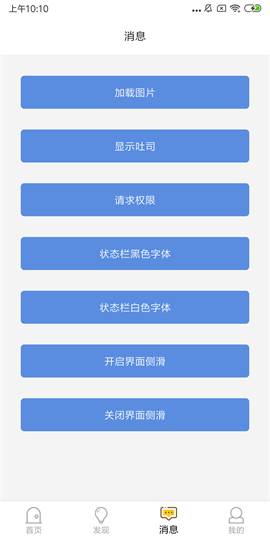
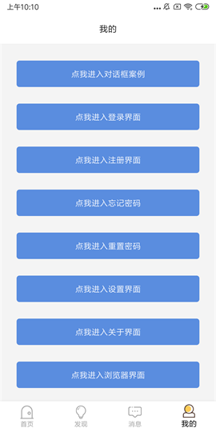
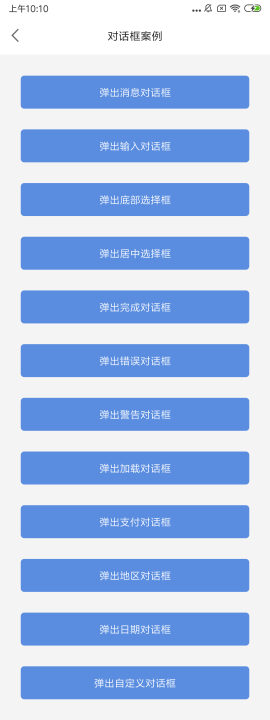
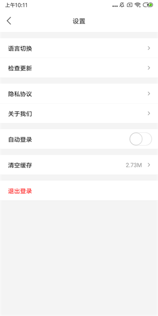

# AndroidTemplate

> 博客地址：[android小咖秀](https://blog.csdn.net/P876643136)

#### 项目初衷

    做开发三五年了。项目也做了些，都是不停地撸码，有自己从0开始的，有从其他人手里接锅的，慢慢的遇到的问题多了起来也就成了经验，自然也就发现很多东西值得整理起来，以备不时之需。随着经验慢慢的有点苗头，开始想要封装一套通用模板框架，用来满足以后项目的开发需求。在这样思索的过程中，恰好网遇了轮子哥，轮子哥早已搭好自己的框架并不断完善，拜读其开源项目(https://github.com/getActivity/AndroidProject)，没啥好说的必须膜拜大神！！

#### 项目背景

> 当github拿到开源项目不会用，导入各种报错，readme看不懂，模块调用花费太多时间

> 当项目紧急时候，我们又要如何较为出色的及时完成

> 当我们日复一日年复一年的搬砖的时候，你是否曾想过提升一下开发效率？如果一个模板的项目摆在你的面前，那么你还会犹豫吗

> 当然做出一个好的模板项目并非易事，有多少人愿意选择去做，还有多少人选择努力去做好，可能寥寥无几，但是你今天看到的，正是你所想要的，轮子哥已经很好的完成了基础，而我就借助巨人的肩膀进行拓展，封装各样工具类模块，组件化综合案例，融合开发中需要的各种小案例！实现一个真正能解决开发新项目时最大痛点的模板工程，不需要再麻木 Copy 原有旧项目的代码，只需改动少量代码就能得到想要的效果，多余的没用上的模块在完成项目后再移除掉，你会发现开发新项目其实是一件很快乐的事

#### 项目亮点，[详细](./AndroidTemplate/ProjectDetails.md)

* 设计思想解析：对设计思想及使用的设计模式等处理上的优点都作了必要的解析说明，如还无法理解清楚，可小窗咨询

* APP用户体验：已经集成界面侧滑以及状态栏沉浸框架

* 必备优秀框架：危险权限处理，标题栏控件，吐司工具类，圆形ImageView

* 常用页面模板：启动界面，主页界面，登录界面，注册界面，关于界面，浏览器界面

* 集成友盟统计：集成友盟统计，并且加入了友盟多渠道打包，在发布release包时可选择渠道包

* 界面样式规范：项目的严格按照 Material Design 设计进行配色，统一和规范Button和EditText控件样式

* 常用自定义View：圆形ImageView，验证码点击倒计时View，带清除按钮的EditText，等等

* 代码注释规范：代码严格按照谷歌级规范来做，同时依据《阿里巴巴开发手册Android1_0_0》，任何一处不关于原生的 API 都有非常完善的注释

#### 项目规划
>封装通用基础框架，结合应用场景规划不同模块为不同行业提供可行的解决方案设计，再定义开发局部功能模块，如有意向更深入合作开发完整功能模块欢迎详谈。

###### 通用基础框架
* 图片、视频、gif动图轮播
* 集成下拉上拉加载刷新框架
* 网易、滴滴左右导航滑动，下拉菜单
* 人脸、指纹识别
* 第三方授权登录
* QQ侧滑导航
* 消息通知，应用升级
* 二维码生成与识别
* 第三方拍照与图片裁剪
* 图片无损极限压缩
* H5/js交互、pdf、图片显示
* 常用框架四件套 Retrofit+RxJava+mvvm+Dagger2
* bugly异常日志捕获
* 权限、屏幕适配(今日头条)
* 数据处理、文件读写等等各类工具库

###### 电商购物消费类
* 美团淘宝点餐、支付

###### 社交生活类
* 聊天通讯
* 趣事分享
* 视频直播

###### 金融医疗服务类
* 电子签名
* 各类加密算法库

###### 自动化工控类
* 科大讯飞/百度语音合成/识别
* 高德地图导航、定位
* 视觉识别
* 图像处理
* 信号传输（U并串）
* 指令校验解析
* 指纹仪模块
* 蓝牙无线模块
……

#### 项目集成框架

* 状态栏沉浸：[https://github.com/gyf-dev/ImmersionBar](https://github.com/gyf-dev/ImmersionBar)

* 界面侧滑功能：[https://github.com/bingoogolapple/BGASwipeBackLayout-Android](https://github.com/bingoogolapple/BGASwipeBackLayout-Android)

* 圆形ImageView：[https://github.com/hdodenhof/CircleImageView](https://github.com/hdodenhof/CircleImageView)

* 缩放ImageView：[https://github.com/chrisbanes/PhotoView](https://github.com/chrisbanes/PhotoView)

* ButterKnife注解：[https://github.com/JakeWharton/butterknife](https://github.com/JakeWharton/butterknife)

欢迎各位志同道合的朋友留下您宝贵的意见，在此也将往年收集的[相关资料](https://github.com/peihp/BookWorm)进行分享，尽请享用！！

>欢迎加群：  群名称：和平饭店   群   号：1020544287
>关注公众号： android小咖秀

如果您觉得我的些许辛劳给您节省了大量的开发时间抑或是解决了难题，可以劳烦github帮忙点个star，您的肯定是我无穷的动力。

#### 更感谢扫描下方的二维码随意打赏的朋友，您的支持将鼓励我继续创作:octocat: 要是能打赏个 10.24 :monkey_face:就太:thumbsup:了。

###### 部分已有界面展示

